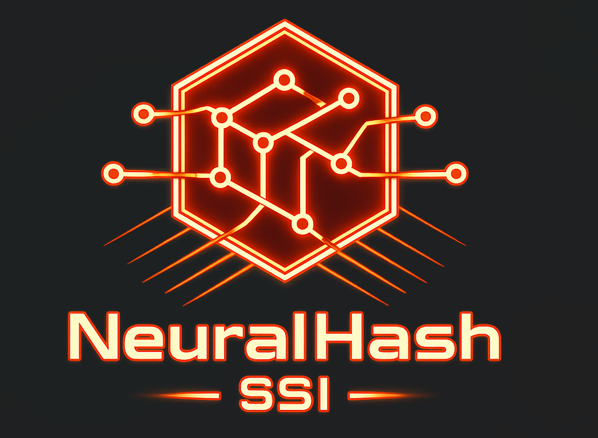

# NeuralHash SSI

<p align="center">
	
</p>

> **The HTTPS layer for Global Identity.** A Self-Sovereign Identity protocol — recoverable, verifiable, and tamper-proof.

## Tech Stack

| Layer | Technology |
|---|---|
| **Blockchain** | Ethereum Sepolia · Solidity Smart Contracts |
| **Client** | Next.js 16 · Wagmi · Viem · RainbowKit (PWA/Mobile Ready) |
| **Storage** | IPFS via Pinata (Decentralized Data Availability) |
| **Intelligence** | Google Gemini (Document Parsing & OCR) |
| **Security** | WebAuthn Hardware-Backed Biometrics |
| **Cryptography** | Merkle Trees (Batch Anchoring) · Zero-Knowledge Proofs |
| **Analytics** | Etherscan API (Gas Transparency & On-Chain Auditing) |


---

## Overview

**NeuralHash SSI** is a Self-Sovereign Identity (SSI) protocol built on Ethereum. It combines decentralized credential issuance, hardware-backed biometric security, on-chain social recovery, and Zero-Knowledge Proofs to give users full ownership of their digital identity — with no central server, no single point of failure, and no gatekeepers.

Unlike traditional systems (DigiLocker, government portals), NeuralHash lets you prove *what you need* without revealing *what you don't*. Prove you're over 18 without exposing your date of birth. Share your degree without handing over your phone number.

---

## The 3 Pillars

### 1. Intelligent Issuer Portal
Issuers upload raw PDFs (marksheets, IDs, certificates). AI-powered OCR extracts structured fields (Name, GPA, Year) and auto-populates the credential schema. Credentials are batch-anchored on-chain using **Merkle Tree hashing** — 10,000 degrees cost the same gas as one, with O(1) on-chain cost regardless of batch size.

### 2. Sovereign Guardian Wallet (`Identity.sol`)
A smart-contract wallet with **on-chain social recovery**. Users designate Guardians (trusted friends/family). If a key is lost:
1. A guardian calls `proposeRecovery(newAddress)`
2. M-of-N guardians call `voteRecovery()`
3. Contract ownership transfers automatically to the new address

No admin reset. No customer support ticket. No seed phrase tattoo required.

### 3. The Interaction Hub (`InteractionHub.sol`)
An on-chain peer-to-peer data request protocol. Employers (or any verifier) request specific credentials; users fulfill requests with **selective disclosure** — sharing only the fields they consent to, cryptographically. Think LinkedIn, but on-chain and user-sovereign.

---

## Key Features

### Zero-Knowledge Proofs
Prove attributes without revealing raw data. A ZK-circuit lets a user generate a proof that `Age > 18 = TRUE` — the verifier confirms the proof on-chain without ever seeing the birthdate.

### Selective Disclosure
Unlike all-or-nothing document sharing, users cryptographically select individual JSON fields to reveal (e.g., `{"degree": "B.Tech"}`) while keeping PII like phone numbers encrypted.

### Hardware-Backed Biometrics (WebAuthn)
Critical actions (revoking credentials, exporting keys) require biometric authentication via `navigator.credentials` — FaceID or TouchID generates a hardware signature before any smart contract interaction. A stolen private key is not enough.

### Merkle Tree Batching
Off-chain hashing aggregates thousands of credentials into a single Merkle Root anchored on-chain. Verification uses Merkle Proofs to confirm inclusion without re-submitting all data.

### Gas Transparency
Real-time Etherscan integration surfaces the estimated USD cost of every transaction before it's submitted.

---

## NeuralHash vs. DigiLocker

| Feature | DigiLocker (Web 2.0) | NeuralHash SSI (Web 3.0) |
|---|---|---|
| **Trust Model** | Trust the server | Trust the math |
| **Availability** | Server downtime = no ID | 100% uptime (Blockchain + IPFS) |
| **Data Ownership** | Government-owned | User-owned (Self-Sovereign) |
| **Privacy** | Full document exposure | ZKP + Selective Disclosure |
| **Account Recovery** | Admin reset | On-chain Social Recovery |
| **Cost** | High infrastructure overhead | Gas-efficient Merkle batching |

---

## Getting Started

Create a `.env.local` file in the project root:

```bash
# Required for OCR/document extraction
GEMINI_API_KEY=your_gemini_api_key

# Required for on-chain analytics charts
ETHERSCAN_API_KEY=your_etherscan_api_key

# Pinata auth (choose one option)
PINATA_JWT=your_pinata_jwt

# OR
PINATA_API_KEY=your_pinata_api_key
PINATA_SECRET_API_KEY=your_pinata_secret_api_key
```

Install dependencies and start the development server:

```bash
pnpm install
pnpm dev
```

Open [http://localhost:3000](http://localhost:3000).

---

## Scripts

| Command | Description |
|---|---|
| `pnpm dev` | Run local development server |
| `pnpm build` | Create production build |
| `pnpm start` | Start production server |
| `pnpm lint` | Run ESLint |

---

## Smart Contracts (Sepolia)

| Contract | Purpose |
|---|---|
| `Identity.sol` | Smart-contract wallet with Guardian-based social recovery |
| `InteractionHub.sol` | On-chain peer-to-peer credential request & fulfillment protocol |

Contracts are audited and deployed on the **Ethereum Sepolia** testnet.

---

## Deployment

Live on **Vercel** as a Mobile PWA — installable on any device, no app store required.

---

<p align="center">Made with ❤️ by Team NeuralHash</p>